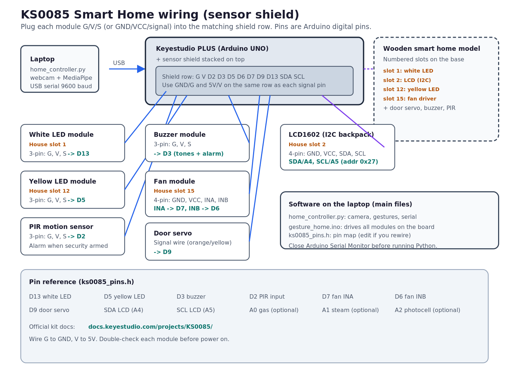

# GestureHome

Control a **Keyestudio KS0085 Smart Home** kit with **hand gestures** from your webcam. Your laptop reads your hands with MediaPipe, sends commands over USB serial, and the Arduino firmware drives the lights, fan, door, LCD, buzzer, and PIR security alarm on the physical house model.

## Wiring and connections

Stack the **sensor shield** on the Keyestudio PLUS board. Plug each module into the shield using **G** (ground), **V** (5 V), and the signal pin listed below. Match the house slot numbers on the wooden base when you place modules.



Source: [docs/assets/ks0085-wiring.svg](docs/assets/ks0085-wiring.svg) (editable wireframe).

### Kit layout (labeled slots on the house model)


The numbers on the kit match the **house slot** column in the table below.

| Module | House slot | Shield connection | Arduino pin | Used for |
|--------|------------|-------------------|-------------|----------|
| White LED | slot 1 | G, V, S | **D13** | Room lights on/off |
| LCD1602 (I2C) | slot 2 | GND, VCC, SDA, SCL | **A4/A5** (I2C `0x27`) | Status text |
| Buzzer | - | G, V, S | **D3** | Sound cues and alarm |
| PIR motion | - | G, V, S | **D2** | Motion detect (security) |
| Yellow LED | slot 12 | G, V, S | **D5** | Alarm indicator blink |
| Fan driver | slot 15 | GND, VCC, INA, INB | **D7**, **D6** | Fan speed 1/2/3 |
| Door servo | - | signal on servo wire | **D9** | Door open/close |

Pin definitions live in `firmware/gesture_home/ks0085_pins.h`. Official kit assembly: [Keyestudio KS0085 docs](https://docs.keyestudio.com/projects/KS0085/).

**Hardware setup:** upload firmware, Serial Monitor tests, and full pin table in `docs/ARDUINO_LED.md`.

## How it works

```text
Webcam  →  home_controller.py  →  USB serial (9600)  →  gesture_home.ino  →  house modules
```

| File | Runs on | Role |
|------|---------|------|
| `home_controller.py` | Laptop (Python) | Camera, hand tracking, gesture rules, serial |
| `firmware/gesture_home/gesture_home.ino` | Keyestudio board | Parse commands, drive hardware |
| `firmware/gesture_home/ks0085_pins.h` | (included by firmware) | Pin map for your wiring |

No browser is required. One Python program on the laptop talks directly to the board.

## What you need

| Item | Notes |
|------|--------|
| Keyestudio KS0085 kit | PLUS board + sensor shield + house model |
| USB cable | Laptop to board |
| Webcam | Built-in or external |
| Arduino IDE | Upload `gesture_home.ino` |
| Python 3.9–3.12 | Conda env `home` (see below) |

## Setup (first time)

### 1. Wire and upload firmware

1. Wire modules per the diagram and table above (or use the kit's pre-wired layout).
2. Open `firmware/gesture_home/gesture_home.ino` in Arduino IDE.
3. Board: **Arduino UNO** (Keyestudio PLUS). Select the correct USB port.
4. Upload. On boot the white LED blinks twice, then waits for commands.

### 2. Test with Serial Monitor

1. Arduino IDE → Tools → Serial Monitor, **9600 baud**, newline.
2. Type `LIGHTS_ON` and `LIGHTS_OFF` to test the white LED.
3. Type `HELP` for the full command list.
4. **Close Serial Monitor** before running Python (only one program can use USB serial).

### 3. Python environment

```bash
git clone https://github.com/goodluckoguzie/GestureHome.git
cd GestureHome
conda env create -f environment.yml   # first time only
conda activate home
pip install -r requirements.txt
```

The first run downloads the MediaPipe hand model (~7.5 MB) into `models/`.

### 4. Run GestureHome

```bash
conda activate home
python home_controller.py --port /dev/ttyUSB0
```

On Linux, pick your port with `ls /dev/ttyUSB* /dev/ttyACM*`. Without a board: `python home_controller.py --no-serial`.

You get an OpenCV window with a green hand skeleton and on-screen status while you gesture.

## Gesture guide

Hold each pose until the timer completes. There is a short cooldown between commands.

| Action | Gesture | Hold time |
|--------|---------|-----------|
| Lights ON | One closed fist | 3 s (LED blinks while holding) |
| Lights OFF | One open palm | 3 s (LED blinks while holding) |
| Fan speed 1 / 2 / 3 | 1, 2, or 3 extended fingers | 2 s |
| Fan stop | Thumbs up | 2 s |
| Door toggle | Two closed fists | 2 s |
| Security arm / disarm | Wave for 2 s, or two open palms (10 fingers) | 2 s |

When security is armed, PIR motion triggers the yellow LED blink and buzzer alarm on the house.

## Keyboard shortcuts

Use these if the camera is awkward or for quick testing:

| Key | Action |
|-----|--------|
| `o` | Lights on |
| `f` | Lights off |
| `1` / `2` / `3` | Fan speed 1 / 2 / 3 |
| `0` | Fan stop |
| `d` | Door toggle |
| `s` | Security arm / disarm |
| `q` | Quit |

## Serial commands (firmware)

The Python app sends these over USB. You can also type them in Serial Monitor:

`LIGHTS_ON`, `LIGHTS_OFF`, `HOLD_ON`, `HOLD_OFF`, `FAN_SPEED_1`, `FAN_SPEED_2`, `FAN_SPEED_3`, `FAN_STOP`, `DOOR_TOGGLE`, `SECURITY_ON`, `SECURITY_OFF`, `STATUS`, `HELP`

## Troubleshooting

| Problem | What to try |
|---------|-------------|
| LED never lights | Run the optional blink sketch on D13; check G/V/S wiring |
| Upload fails | Board = Arduino UNO; try another USB cable |
| Python cannot open port | Close Serial Monitor; check `ls /dev/ttyUSB*` |
| Permission denied on USB | `sudo chmod a+rw /dev/ttyUSB0` |
| No camera | `python home_controller.py --camera 1` |
| Gestures hard to trigger | Good lighting, plain background; use keyboard keys to test serial path first |

## Repository layout

```text
GestureHome/
├── home_controller.py              # Main app (start here on the laptop)
├── firmware/
│   ├── gesture_home/
│   │   ├── gesture_home.ino        # Main firmware (upload to board)
│   │   └── ks0085_pins.h           # Pin map
│   └── phase0_led_blink/           # Optional LED wiring test
├── docs/
│   ├── assets/ks0085-wiring.svg    # Wiring diagram (this page)
│   ├── MANUAL.md                   # Full user manual
│   └── ARDUINO_LED.md              # Hardware setup and pin table
├── environment.yml                 # Conda env: home
├── requirements.txt
├── bridge/                         # Legacy: browser + FastAPI (optional)
└── web/                            # Legacy: browser UI (optional)
```

The recommended path is **Python + Arduino** above. The `web/` and `bridge/` folders are an older browser-based approach.

## More documentation

- **`docs/MANUAL.md`** - full user manual (gestures, keys, troubleshooting)
- **`docs/ARDUINO_LED.md`** - hardware setup, pin table, firmware upload
- **`docs/BRANCHES.md`** - `main` vs `legacy/web-bridge` vs `upgrade/booth`
