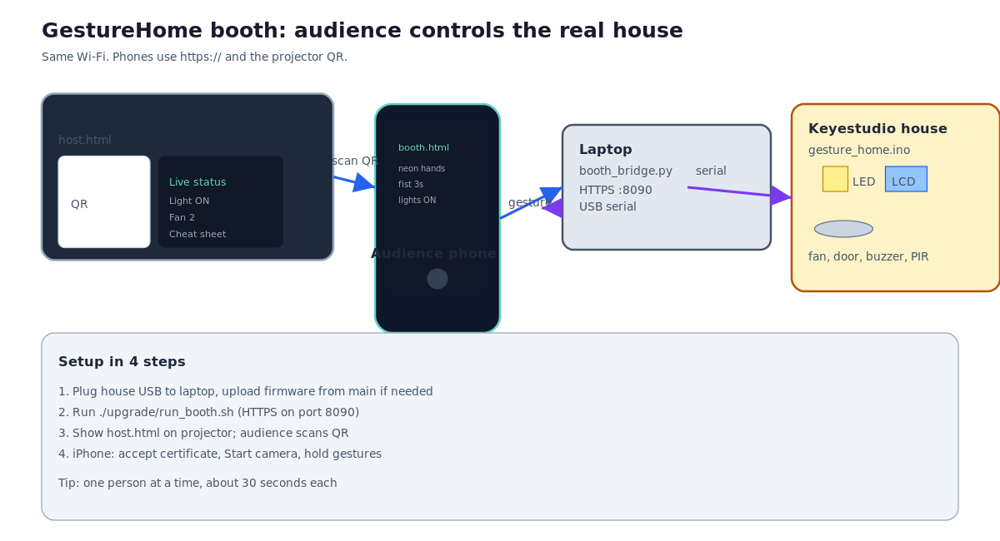
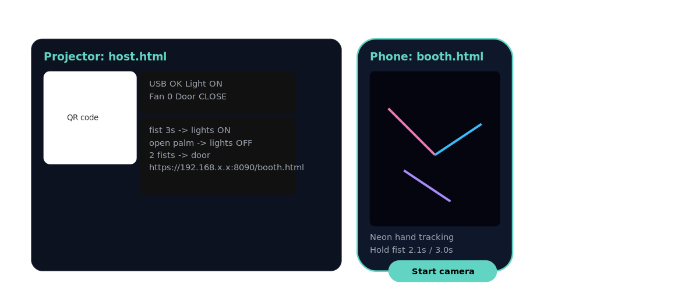
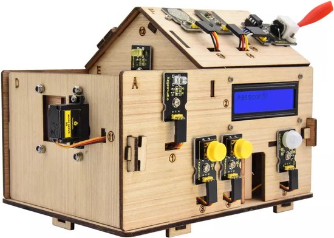

# GestureHome Event Booth

**Branch:** `upgrade/booth`  
**Repo:** [github.com/goodluckoguzie/GestureHome](https://github.com/goodluckoguzie/GestureHome)

Turn your IoT smart home demo into an **interactive booth**: the audience scans a QR code on the projector, opens the page on their phone, uses the camera, and controls the **real Keyestudio house** on your table.

**Status:** Tested (projector QR, iPhone HTTPS camera, gestures, physical lights/fan/door).

---

## What this branch does

| | `main` branch | **`upgrade/booth` (this branch)** |
|---|---------------|-----------------------------------|
| Who controls the house | One person on the laptop | **Anyone with a phone** |
| Screen | OpenCV window on laptop | **Projector + audience phones** |
| Start command | `python home_controller.py` | **`./upgrade/run_booth.sh`** |
| Best for | Solo dev demo | **LaunchPoint / IoT showcase** |

```text
QR on projector  ->  phone opens booth page  ->  laptop booth_bridge  ->  USB  ->  house
```



---

## What the audience sees

### Projector (big screen)



- **Page:** `host.html`
- **Shows:** QR code, join URL, live house status, gesture cheat sheet

### Phone (audience)

- **Page:** `booth.html`
- **Shows:** Camera, neon hand tracking, hold timer, cheat sheet
- **Does:** Sends gestures to the laptop, which drives the real house

### Physical house (on your table)



Lights, fan, door servo, LCD, buzzer, and PIR security on the wooden kit.

---

## Quick start (3 commands)

```bash
git clone https://github.com/goodluckoguzie/GestureHome.git
cd GestureHome
git checkout upgrade/booth

conda activate home
pip install -r requirements.txt -r bridge/requirements.txt

# Plug Keyestudio USB, then:
./upgrade/run_booth.sh
```

The script prints two URLs and opens the **projector page**:

```text
Projector:  https://192.168.1.156:8090/host.html
Phone:        https://192.168.1.156:8090/booth.html
```

(Your laptop IP will differ. Use the addresses printed in the terminal.)

---

## Event day guide

### Before you open the room

| Step | Action |
|------|--------|
| 1 | Upload `firmware/gesture_home/gesture_home.ino` from this branch (same as `main`) |
| 2 | Plug house USB into laptop (`/dev/ttyUSB0` typical) |
| 3 | Run `./upgrade/test_booth.sh` - should show `OK LIGHTS_ON` |
| 4 | Laptop and phones on **same Wi-Fi** |

Wiring reference:


More hardware detail: switch to `main` branch README or `docs/ARDUINO_LED.md`.

### During the showcase

| Step | Who | What |
|------|-----|------|
| 1 | You | Run `./upgrade/run_booth.sh` |
| 2 | You | Connect laptop to projector, full-screen **host.html** |
| 3 | Audience | Scan QR on projector |
| 4 | Audience | Accept certificate (iPhone), tap **Start camera** |
| 5 | Audience | Hold gestures (see table below) |
| 6 | Everyone | Watch the **physical house** respond |

**Tip:** One person at a time, about 30 seconds. Keeps it fun and calm.

### iPhone camera (required)

Safari blocks the camera on plain `http://` links. This branch uses **HTTPS** automatically.

1. Scan QR - link must start with **`https://`**
2. Safari warns about certificate -> **Advanced** -> **Proceed**
3. Tap **Start camera**
4. Gesture

If you see `getUserMedia` errors, you opened `http://` by mistake. Use the QR from the projector.

---

## Gesture cheat sheet

Hold each pose until the on-screen timer finishes.

| Action | Gesture | Hold |
|--------|---------|------|
| Lights ON | Closed fist | 3 s |
| Lights OFF | Open palm | 3 s |
| Fan speed 1 / 2 / 3 | 1, 2, or 3 fingers | 2 s |
| Fan stop | Thumbs up | 2 s |
| Door toggle | Two closed fists | 2 s |
| Security on/off | Wave, or two open palms | 2 s |

---

## How it works (technical)

```text
+----------------------------------------------------------+
|  PROJECTOR: upgrade/web/host.html  (QR + live status)    |
+---------------------------+------------------------------+
                            |
+----------------------------------------------------------+
|  PHONES: upgrade/web/booth.html  (MediaPipe gestures)    |
+---------------------------+------------------------------+
                            | HTTPS POST /command
+----------------------------------------------------------+
|  upgrade/booth_bridge.py  (FastAPI on 0.0.0.0:8090)      |
+---------------------------+------------------------------+
                            | USB serial 9600
+----------------------------------------------------------+
|  firmware/gesture_home/gesture_home.ino  (Keyestudio)      |
+----------------------------------------------------------+
```

**Do not** run `home_controller.py` and `booth_bridge.py` on the same USB port.

### URLs (replace IP with yours)

| Page | URL |
|------|-----|
| Projector | `https://<laptop-ip>:8090/host.html` |
| Phone | `https://<laptop-ip>:8090/booth.html` |
| Health check | `https://<laptop-ip>:8090/health` |
| Join info (JSON) | `https://<laptop-ip>:8090/booth-info` |

### API

```bash
curl -sk https://127.0.0.1:8090/health
curl -sk -X POST https://127.0.0.1:8090/command \
  -H "Content-Type: application/json" \
  -d '{"cmd":"LIGHTS_ON"}'
```

---

## Files on this branch

| File | What it does |
|------|----------------|
| `upgrade/run_booth.sh` | **Start here** - HTTPS server + opens projector |
| `upgrade/booth_bridge.py` | API + USB serial to Arduino |
| `upgrade/web/host.html` | Projector page with QR |
| `upgrade/web/booth.html` | Phone gesture page |
| `upgrade/web/booth.js` | MediaPipe + gesture logic |
| `upgrade/test_booth.sh` | Automated smoke test |
| `upgrade/assets/` | Images for this guide |

### Frozen (shared with `main`, do not change for booth)

- `home_controller.py`
- `firmware/gesture_home/gesture_home.ino`
- `firmware/gesture_home/ks0085_pins.h`

Booth code lives only under `upgrade/`.

---

## Troubleshooting

| Problem | Fix |
|---------|-----|
| GitHub shows old README | You are on `main`. Run `git checkout upgrade/booth` |
| Phone cannot open page | Same Wi-Fi; use printed LAN IP, not `127.0.0.1` |
| Camera error on iPhone | Use **https://** from QR; accept certificate |
| `getUserMedia` missing | Never use `http://` on phones |
| Serial busy | Close Arduino Serial Monitor; stop `home_controller.py` |
| USB permission | `sudo chmod a+rw /dev/ttyUSB0` |
| Port 8090 in use | `fuser -k 8090/tcp` then restart |

---

## Test checklist

```bash
./upgrade/run_booth.sh          # terminal 1
./upgrade/test_booth.sh           # terminal 2 - expect PASS
```

Phone test: open `https://<laptop-ip>:8090/booth.html`, accept cert, Start camera, hold fist 3s, LED on house should turn on.

---

## Other branches

| Branch | Use |
|--------|-----|
| `main` | Solo laptop demo (`home_controller.py`) |
| `upgrade/booth` | **This guide** - audience booth |
| `legacy/web-bridge` | Older browser bridge (reference only) |

Style: plain ASCII in docs. No em dashes.
