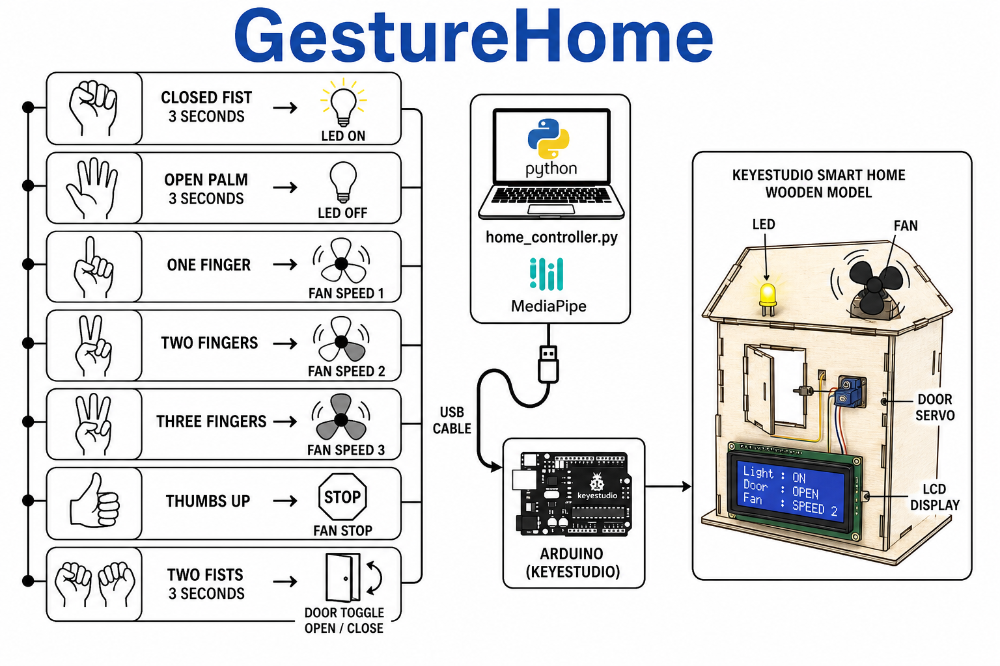
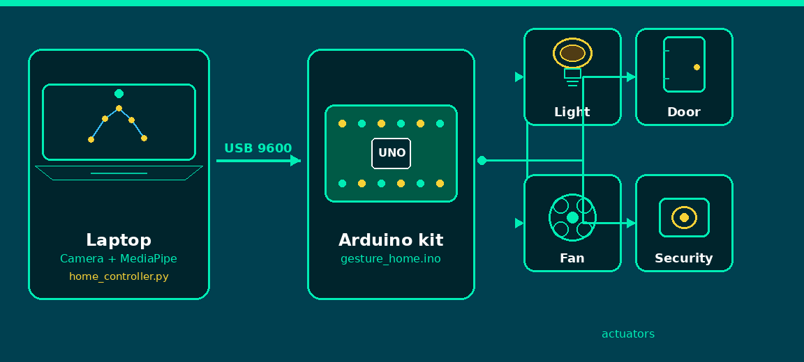

# GestureHome

**Hands-free smart home and security.** Control a Keyestudio Smart Home kit with webcam gestures.

Webcam → MediaPipe → `home_controller.py` → USB serial (9600) → `gesture_home.ino` → **LED, door, fan, PIR security**.

| | |
|---|---|
| **Presentation** | **[View the IoT talk slides](https://goodluckoguzie.github.io/GestureHome/)** (Reveal.js, QAHE branded) |
| **Live demo** | `python home_controller.py` on branch `main` |
| **Kit** | Keyestudio PLUS + sensor shield (KS0085) |



---

## What this project does

GestureHome turns hand poses in a webcam into serial commands for a Keyestudio smart-home kit. You hold a gesture for a few seconds; Python sends a line like `LIGHTS_ON` or `DOOR_TOGGLE` over USB; the Arduino drives the LED, door servo, fan, LCD, buzzer, and PIR security mode.

No phone app and no touch on shared switches for the demo path on `main`.

---

## Presentation

5-minute QA Higher Education IoT talk. Same Reveal.js style as the [PhD Viva deck](https://goodluckoguzie.github.io/Viva/).

**Slides:** https://goodluckoguzie.github.io/GestureHome/

Open fullscreen in Chrome. Keys: → next, ↓ extra detail on Architecture / Stack, **S** speaker notes.

---

## Hardware

| Item | Notes |
|------|--------|
| Keyestudio PLUS (Arduino UNO) + sensor shield | Assumed **KS0085** wiring |
| USB cable | Laptop to board |
| Laptop webcam | Built-in or USB camera |
| White LED (D13), fan, door servo, LCD, buzzer, PIR | On the smart-home shield |

Confirm your kit model on the box before upload.

---

## Reproduce the demo (step by step)

### 1. Clone and open the repo

```bash
git clone https://github.com/goodluckoguzie/GestureHome.git
cd GestureHome
git checkout main
```

### 2. Python environment

Use Conda (recommended) or a venv:

```bash
conda env create -f environment.yml   # once
conda activate home
pip install -r requirements.txt
```

MediaPipe downloads `models/hand_landmarker.task` on first run if it is missing.

### 3. Upload Arduino firmware

1. Open `firmware/gesture_home/gesture_home.ino` in Arduino IDE.
2. Board: **Arduino UNO**. Port: `/dev/ttyUSB0` or `/dev/ttyACM0` (Linux) / `COMx` (Windows).
3. Upload.
4. Serial Monitor at **9600** baud: type `LIGHTS_ON` then `LIGHTS_OFF` to test the LED.

### 4. Run the laptop controller

```bash
python home_controller.py
```

Optional flags:

```bash
python home_controller.py --port /dev/ttyUSB0   # pick USB port
python home_controller.py --no-serial             # camera + skeleton only
python home_controller.py --camera 1              # second webcam
```

You should see an OpenCV window with hand skeleton overlay. Gestures below trigger commands when held for the listed time.

### 5. Test gestures

| Gesture | Hold | Serial command | House |
|---------|------|----------------|-------|
| Closed fist | 3s | `LIGHTS_ON` | White LED on |
| Open palm | 3s | `LIGHTS_OFF` | White LED off |
| 1 / 2 / 3 fingers | 2s | `FAN_SPEED_1` / `_2` / `_3` | Fan speed |
| Thumbs up | 2s | `FAN_STOP` | Fan off |
| Two fists | 2s | `DOOR_TOGGLE` | Door servo |
| Wave or two open palms | 2s | `SECURITY_ON` / `SECURITY_OFF` | PIR alarm mode |

**Keyboard backup** (demo window focused): `o` / `f` lights, `1` `2` `3` fan, `0` stop, `d` door, `s` security, `q` quit.

---

## How it is built

### Software stack



```text
Hands → webcam → MediaPipe keypoints → home_controller.py → USB 9600 → gesture_home.ino → LED · door · fan · PIR
```

| Layer | File / folder | Role |
|-------|----------------|------|
| Sense | Laptop webcam | Video frames |
| Decide | `home_controller.py` | MediaPipe hands, hold timers, gesture rules |
| Connect | USB serial @ 9600 | Line-based ASCII commands |
| Act | `firmware/gesture_home/gesture_home.ino` | LED, servo, fan PWM, LCD, buzzer, PIR |

### Serial protocol

One command per line, newline-terminated, 9600 baud:

`LIGHTS_ON`, `LIGHTS_OFF`, `FAN_SPEED_1`, `FAN_SPEED_2`, `FAN_SPEED_3`, `FAN_STOP`, `DOOR_TOGGLE`, `SECURITY_ON`, `SECURITY_OFF`

Arduino prints `OK <command>` when it accepts a line.

### Project layout

```text
GestureHome/
├── home_controller.py      # Main demo (webcam + MediaPipe + serial)
├── firmware/gesture_home/  # Arduino sketch
├── docs/                   # Wireframes and teaching diagrams (PNG + SVG)
├── talk/                   # Reveal.js presentation (also on GitHub Pages)
├── requirements.txt
├── environment.yml
└── GESTUREHOME_FOCUS_NOW.md
```

More wireframe styles for teaching live in `docs/`:

| File | Best for |
|------|----------|
| `docs/gesturehome-wireframe.png` | Full pipeline map |
| `docs/gesturehome-vertical.png` | Step-by-step lesson |
| `docs/gesturehome-swimlane.png` | Engineering / CS students |
| `docs/gesturehome-classroom.png` | Beginners |

Regenerate IoT talk videos locally: `talk/scripts/make_iot_flow.py`, `make_gesturehome_hero.py`, `make_stack_flow.py`.

---

## Branches

| Branch | Use |
|--------|-----|
| **`main`** | Laptop webcam + OpenCV (`home_controller.py`). Default. |
| **`upgrade/booth`** | Audience phones + projector booth |
| **`legacy/web-bridge`** | Browser + FastAPI bridge (`web/` + `bridge/`) |

See `docs/BRANCHES.md` and `GESTUREHOME_FOCUS_NOW.md` for booth setup and focus notes.

---

## Troubleshooting

| Problem | Fix |
|---------|-----|
| No serial port | Plug in USB; try `--port /dev/ttyACM0`; list ports in Arduino IDE |
| LED works in Serial Monitor but not from Python | Same baud (9600); close Serial Monitor before running Python |
| Camera not found | `--camera 0` or `1`; check permissions |
| Gestures never fire | Hold longer; one hand in frame for lights/fan; two fists for door |

Preview without hardware: `python home_controller.py --no-serial`

---

## Git hooks (optional)

To stop accidental `Co-authored-by: Cursor` lines on commits (which add unwanted GitHub contributors):

```bash
git config core.hooksPath githooks
```

The hook in `githooks/prepare-commit-msg` strips those trailers before each commit is created.

---

## Links

- **Presentation:** https://goodluckoguzie.github.io/GestureHome/
- **Repository:** https://github.com/goodluckoguzie/GestureHome
- **Phase 1 notes:** `docs/PHASE1.md`
